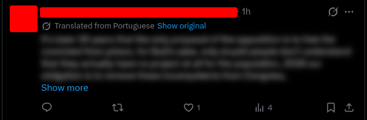

 ToxiBlock

Extensão Chrome que detecta e filtra comentários tóxicos em tempo real no YouTube e Twitter/X usando Machine Learning.

Comentários identificados como ofensivos recebem blur automático — clique para revelar se quiser ler mesmo assim.

## Demo



[Instalar na Chrome Web Store](https://chromewebstore.google.com/detail/gbdijbaipjncfbjecgpfbbadhnibchha?utm_source=item-share-cb)

## Como funciona

1. A extensão captura comentários conforme aparecem na página (scroll infinito incluído)
2. Cada texto é traduzido automaticamente PT→EN e enviado para a [SentimentAI API](https://sentimentai-api.onrender.com/docs)
3. O modelo — treinado no dataset Jigsaw Toxic Comments do Kaggle — classifica o comentário
4. Se a confiança for ≥ 65% e o resultado for tóxico, aplica blur
5. Clique no comentário embaçado para revelar o texto
6. Use o popup para ligar ou desligar o filtro a qualquer momento

## Detalhes técnicos

- **MutationObserver** — detecta novos comentários carregados dinamicamente, sem precisar recarregar a página
- **Threshold de confiança (65%)** — evita falsos positivos, só aplica blur quando o modelo tem certeza suficiente
- **Tradução automática PT→EN** — o modelo foi treinado em inglês, mas funciona com comentários em português
- **Modelo próprio** — retreinado com o [Jigsaw Toxic Comment Dataset](https://www.kaggle.com/c/jigsaw-toxic-comment-classification-challenge), integrado via API FastAPI

## Tecnologias

- JavaScript (Chrome Extensions API — Manifest V3)
- [SentimentAI](https://github.com/Renanmrqs/SentimentAI) — API própria com FastAPI, scikit-learn e hospedada no Render

## Como instalar localmente

1. Clone o repositório
```bash
git clone https://github.com/Renanmrqs/ToxiBlock.git
```
2. Acesse `chrome://extensions/` no Chrome
3. Ative o **Modo do Desenvolvedor**
4. Clique em **Carregar sem compactação** e selecione a pasta do projeto

> A API pode demorar alguns segundos na primeira requisição — hospedada no plano gratuito do Render.

## Próximos passos

- [✅] Modelo retreinado com dataset específico para toxicidade (Jigsaw/Kaggle)
- [✅] Suporte a scroll infinito com MutationObserver (YouTube e Twitter/X)
- [✅] Tradução automática para suporte a português
- [✅] Publicar na Chrome Web Store